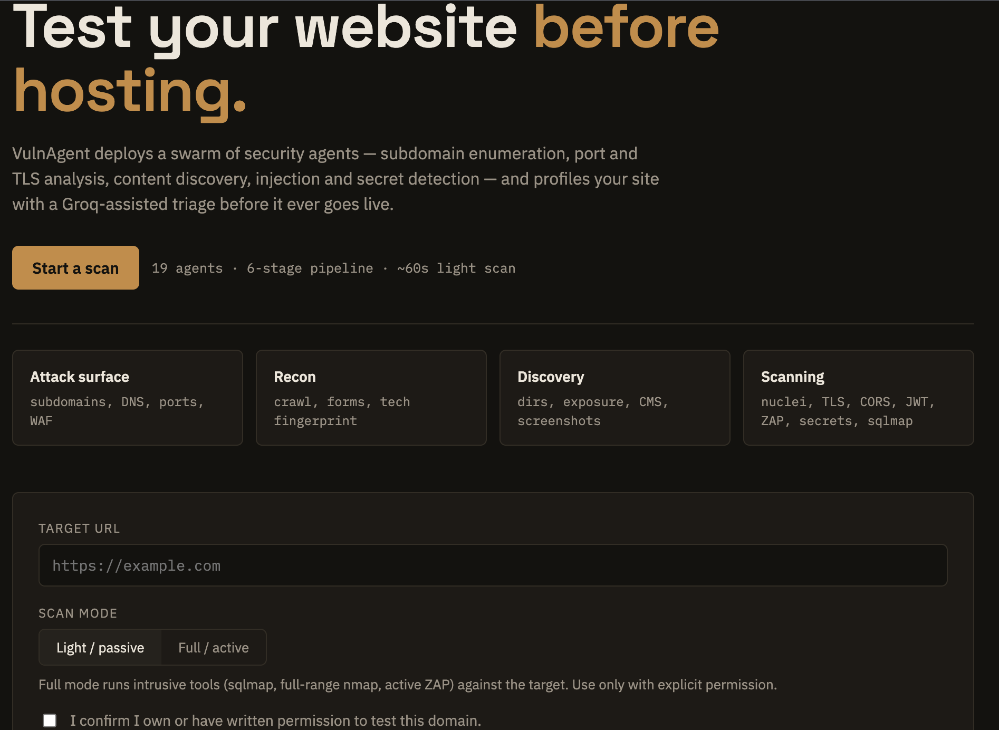
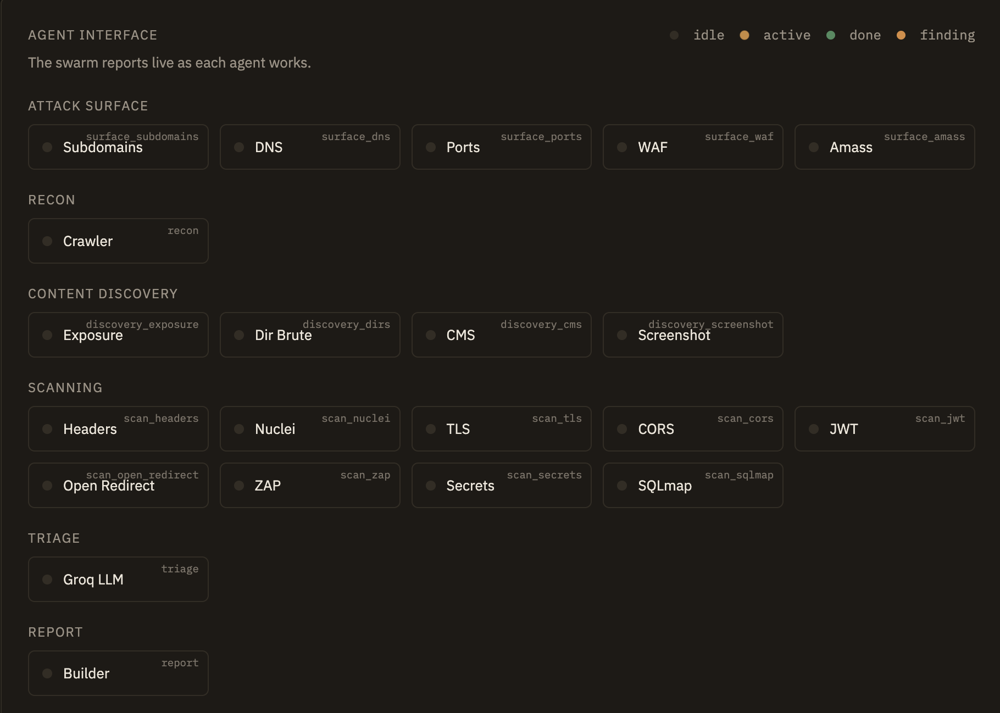

# VulnAgent — Multi-Agent Web Security Scanner

> 20 AI agents scan and triage websites in minutes: mapping subdomains, ports, and WAFs,
> then probing headers, TLS, CORS, CMS, and injection points via nuclei, testssl, ffuf, ZAP,
> and sqlmap. An LLM triage agent prioritizes findings, boosted by RAG memory that recalls
> past reports and analyst feedback. Plain-English summaries make results actionable.

VulnAgent is an autonomous, multi-agent web security scanning platform. A swarm of
specialized agents recon a target, discover its attack surface, run real security tools,
and a final LLM-powered triage agent dedupes, prioritizes, and explains every finding —
backed by a **RAG memory** of past verdicts, uploaded policy documents, and analyst feedback.

The scanner ships with a real-time React dashboard: live per-agent status, streaming logs,
severity metrics, a risk score, top risks, and screenshots — all delivered over Server-Sent
Events.

> **Important:** You may only scan systems you own or have explicit written authorization to
> test. The API refuses to start a scan until authorization is confirmed.

---

## Features

- **20 autonomous agents** across 6 stages: Attack Surface, Recon, Content Discovery,
  Scanning, Triage, and Report.
- **Real security tooling** — nuclei, testssl, ffuf, nmap, ZAP, sqlmap, amass, wafw00f —
  orchestrated from pure-Python + httpx agents.
- **Two scan modes**:
  - `light` — ~1 minute, polite, high-value checks (ideal for a quick health check).
  - `full` — sequential, deeper, active tooling (nmap `-p-`, amass, sqlmap, large wordlists).
- **LLM triage** that dedupes and ranks findings, then writes plain-English
  explanations and remediation hints.
- **RAG memory** (Chroma + SQLite): retrieval-augmented triage that recalls prior analyst
  verdicts and uploaded policy documents to keep results consistent and informed.
- **Analyst feedback loop** — mark findings True/False/Uncertain; the verdicts are stored
  and reused by future triage runs.
- **Real-time dashboard** — SSE stream with per-agent live status, stage progress, screenshots,
  risk score, executive summary, and top risks.
- **Safety built-in** — active/aggressive tools are gated behind `full` mode; sqlmap is
  detection-only (never exploits); robots.txt is respected.

---

## Screenshots

| Scan dashboard — live agent swarm | Scan report — risk score & findings |
|---|---|
|  |  |

## How it works

### Pipeline

```
                        ┌──────────────────────────────┐
                        │       light mode             │
   /scan ──► surface ───┤  (subdomains/dns/waf first)  │
                        │  then: ports, scans, recon,  │
                        │  discovery run in parallel   │
                        └──────────────┬───────────────┘
                                       ▼
    full mode ──► strict sequential DAG (each stage feeds the next)
                                       ▼
                          ┌──────────────────────┐
                          │  triage (LLM + RAG)  │
                          │  report builder      │
                          └──────────────────────┘
                                       ▼
                          report_ready → SSE → dashboard
```

### Agents

| Stage | Agent | What it does |
|-------|-------|--------------|
| Attack Surface | `surface_subdomains` | Passive subdomain discovery (cert/CT sources) |
| Attack Surface | `surface_dns` | DNS resolution, CNAME checks (capped in light) |
| Attack Surface | `surface_ports` | Port scan via nmap (top-100 light / `-p-` full) |
| Attack Surface | `surface_waf` | WAF detection via wafw00f |
| Attack Surface | `surface_amass` | Active subdomain enumeration (**full only**) |
| Recon | `recon` | Crawler: fetches pages, forms, robots.txt, tech fingerprinting |
| Content Discovery | `discovery_exposure` | Probes exposed files (`.git`, `.env`, backups, phpinfo…) |
| Content Discovery | `discovery_dirs` | Directory brute-force via ffuf |
| Content Discovery | `discovery_cms` | CMS fingerprinting |
| Content Discovery | `discovery_screenshot` | Headless-Chrome page screenshots |
| Scanning | `scan_headers` | Security header audit (CSP, HSTS, XFO, XCTO…) |
| Scanning | `scan_nuclei` | nuclei template scanning |
| Scanning | `scan_tls` | TLS config audit via testssl |
| Scanning | `scan_cors` | CORS misconfiguration checks |
| Scanning | `scan_jwt` | JWT configuration checks |
| Scanning | `scan_open_redirect` | Open redirect detection |
| Scanning | `scan_zap` | OWASP ZAP active scan (Docker, **full only**) |
| Scanning | `scan_secrets` | Secret/key detection in exposed content |
| Scanning | `scan_sqlmap` | SQL injection detection (**full only**, never exploits) |
| Triage | `triage` | LLM: dedupe, prioritize, explain + RAG context |
| Report | `report` | Assembles findings, risk score, executive summary, top risks |

### Anti-false-positive safeguards

- **SPA / soft-404 detection** — hosts with a `/* → /index.html 200` rewrite return the
  same shell for every path. Both `discovery_exposure` and `discovery_dirs` detect this and
  filter out shell responses, so a React/SPA site isn't reported as "every backup archive
  exposed".
- **Connection-failure honesty** — if the target can't be reached, the report says so and
  *never* claims the site is clean.
- **Resilient stages** — a single agent error is logged and skipped; a stage only fails if
  every agent in it fails.

---

## Tech stack

| Layer | Technology |
|-------|------------|
| Backend | Python 3.11+, FastAPI, httpx, asyncio |
| Frontend | React 19, Vite 8, plain CSS |
| Realtime | Server-Sent Events (sse-starlette) |
| LLM | LLM (`openai/gpt-oss-120b` default) |
| Memory | Chroma (vector store) + SQLite (source of truth) |
| Tooling | nuclei, testssl, ffuf, nmap, sqlmap, amass, wafw00f, headless Chrome, ZAP (Docker) |

---

## Prerequisites

- **Python 3.11+**
- **Node.js 20+** (for the frontend)
- **External security tools** (macOS Homebrew shown):

```bash
brew install ffuf nmap nuclei sqlmap amass testssl wafw00f
```

- **Google Chrome** — used by the screenshot agent
  (`/Applications/Google Chrome.app/Contents/MacOS/Google Chrome`).
- **ZAP (optional, full mode only):**

```bash
docker pull zaproxy/zap-stable
```

- **Nuclei templates** (auto-managed by nuclei):

```bash
nuclei -update-templates
```

- **An LLM API key** — used for triage.

---

## Getting started

### 1. Backend

```bash
cd backend
python3 -m venv venv
source venv/bin/activate
pip install -r requirements.txt
```

Create the environment file:

```bash
cp .env.example .env   # if present, otherwise create backend/.env
```

```bash
# backend/.env
LLM_API_KEYS=your_llm_api_keys_here          # comma-separated for round-robin
LLM_MODEL=openai/gpt-oss-120b
```

Run the API:

```bash
uvicorn main:app --port 8000
```

API docs: <http://localhost:8000/docs>

### 2. Frontend

```bash
cd frontend
npm install
npm run dev
```

Open <http://localhost:5173> (Vite picks another port if 5173 is taken). The frontend calls
`http://localhost:8000` directly.

### 3. Run a scan

1. Enter a URL (e.g. `https://your-site.com/`).
2. Tick **"I confirm I have authorization to test this site"** — required.
3. Choose `light` (fast) or `full` (deep).
4. Watch the agent swarm work live; the report appears when it's done.

---

## Deploying

### Backend on Render

1. Push this repo to GitHub and create a **New Web Service** in Render, pointing at the repo.
2. Render reads `backend/render.yaml` for the service config, or configure manually:
   - **Root Directory:** `backend`
   - **Build:** `pip install -r requirements.txt`
   - **Start:** `uvicorn main:app --host 0.0.0.0 --port $PORT`
   - **Runtime:** Python 3.11+
3. Add the environment variable `LLM_API_KEYS` (comma-separated keys) — never commit keys.
   Optionally set `LLM_MODEL`.
4. Note the deployed URL, e.g. `https://your-backend.onrender.com`.

> On Render, external tools (nuclei, testssl, ffuf, nmap, sqlmap, Chrome) are **not** installed,
> so the tool-based agents gracefully report "not found" and skip. The LLM triage agent still
> works. For full tooling, deploy on a machine where the binaries are installed.

### Frontend on Vercel

1. Import the repo in Vercel (framework auto-detected as **Vite**).
2. Set the environment variable `VITE_API_ORIGIN` to your backend URL, e.g.
   `https://your-backend.onrender.com`.
3. Deploy — the app calls the backend from `VITE_API_ORIGIN` and the SSE stream, feedback
   endpoint, and screenshot URLs all use the same origin.

---

## Configuration

Environment variables (backend `.env`):

| Variable | Default | Purpose |
|----------|---------|---------|
| `LLM_API_KEYS` | — | Comma-separated LLM API keys (round-robin) |
| `LLM_MODEL` | `openai/gpt-oss-120b` | LLM model used for triage |
| `ZAP_DOCKER_IMAGE` | `zaproxy/zap-stable` | ZAP container image |
| `NUCLEI_TEMPLATES_PATH` | `~/nuclei-templates` | nuclei template location |
| `WORDLIST_COMMON` / `LIGHT` / `MICRO` | `data/wordlists/*.txt` | ffuf wordlists per mode |

---

## API reference

| Method | Path | Description |
|--------|------|-------------|
| `GET` | `/` | Service health |
| `POST` | `/scan` | Start a scan. Body: `{url, authorization_confirmed, scan_mode}`. Requires `authorization_confirmed: true`. Returns `job_id`. |
| `GET` | `/scan/{job_id}/stream` | SSE live feed (stage/agent events + `report_ready`) |
| `GET` | `/scan/{job_id}/report` | Completed report JSON |
| `POST` | `/feedback` | Record analyst verdict for a finding |
| `GET` | `/feedback?limit=` | List feedback |
| `POST` | `/documents/upload` | Upload a policy/reference document (multipart) |
| `GET` | `/documents` | List uploaded documents |
| `GET` | `/memory/lessons` | Memory stats + lessons |
| `GET` | `/screenshots/{job_id}/…` | Served scan screenshots |

### Report shape

```jsonc
{
  "job_id": "…",
  "url": "https://target/",
  "scan_mode": "light",
  "scanned_at": "…",
  "summary": {
    "total": 6,
    "by_severity": {"high": 1, "medium": 0, "low": 3, "info": 2},
    "by_category": {"Headers": 6},
    "risk_score": 13,
    "warnings": []
  },
  "executive_summary": "…plain-English…",
  "top_risks": [{"severity": "high", "title": "…", "location": "…"}],
  "findings": [ /* per-finding detail + remediation hint */ ],
  "screenshots": [{"url": "…", "file": "/screenshots/{job_id}/…"}]
}
```

---

## RAG memory & feedback loop

- Analyst verdicts (True/False/Uncertain) and uploaded documents are stored in
  `backend/storage/memory.db` and mirrored into a persistent Chroma index at
  `backend/storage/chroma/`.
- At triage time, the LLM is given the most relevant past verdicts and policy snippets for
  the finding's category — so the scanner learns what you've already confirmed.
- `GET /memory/lessons` reports how many items the model is learning from.

---

## Project structure

```
.
├── backend/
│   ├── agents/            # 20 agent modules (surface_*, recon, discovery_*, scan_*, triage)
│   ├── data/wordlists/    # ffuf wordlists (micro/light/common)
│   ├── llm/               # llm_client.py, prompts.py
│   ├── memory/            # feedback_store.py (SQLite + Chroma)
│   ├── storage/           # runtime: jobs.py, memory.db, chroma/, screenshots/
│   ├── config.py          # env-driven configuration
│   ├── main.py            # FastAPI app + SSE + feedback/document endpoints
│   ├── models.py          # Pydantic models (Finding, Report, ScanJob…)
│   ├── orchestrator.py    # pipeline, stage runner, report builder
│   └── requirements.txt
├── frontend/
│   ├── src/
│   │   ├── components/    # Hero, ScanForm, AgentInterface, ProgressView, ReportView…
│   │   ├── hooks/         # useScanStream.js (SSE)
│   │   ├── api.js         # axios client
│   │   ├── App.jsx
│   │   └── index.css
│   └── package.json
└── .gitignore
```

---

## Notes & limitations

- Scans run in-process; jobs are held in memory and do not survive a backend restart.
- `light` mode is rate-limited and caps concurrency to stay polite to the target.
- `full` mode is intentionally slow (minutes) — active enumeration, full port ranges, and
  aggressive tooling.
- ZAP must be pullable via Docker; the ZAP agent only runs in `full` mode.
- Screenshots require a local Chrome installation.

## License

For authorized security testing only. Use responsibly and only against systems you own or
have permission to test.
